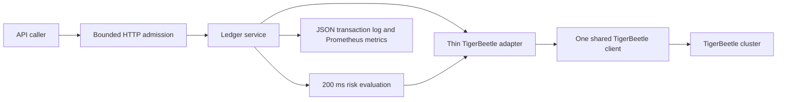

# Ledger Service

A correctness-first Go 1.26 service built on TigerBeetle 0.17.9. TigerBeetle is the sole durable
financial system of record and the authority for balances, atomicity, ordering, idempotency, and
insufficient-funds enforcement.

TigerBeetle ledger `1` represents USD. Every API amount is an unsigned integer number of cents.

## Why this design differs from the challenge

The challenge describes TigerBeetle as eventually consistent and asks the API to acknowledge an
in-memory queue before posting. Current TigerBeetle is strictly serializable, automatically
batches concurrent calls made through a shared client, and returns a result for every create
event. A queue would add an avoidable durability gap and could not truthfully approve an
authorization before its hold exists.

This service therefore submits synchronously and responds only after TigerBeetle acknowledges the
posted transfer or pending hold. It has no application posting queue, batch timer, write-ahead
log, recovery worker, PostgreSQL idempotency table, or shadow balance.



The adapter converts the SDK's batch-shaped API into the four single-command methods used by the
service. The shared SDK client coalesces compatible concurrent calls while its current request is
in flight. The bounded process-local account cache contains only immutable, fully validated
account metadata; balances and idempotency never live in memory. Eviction only causes another
TigerBeetle lookup and cannot affect ledger correctness.

See [ADR 001](docs/adr/001-direct-tigerbeetle-submission.md) and TigerBeetle's
[request documentation](https://docs.tigerbeetle.com/coding/requests/).

## Accounting model

| Account | Code | Accounting type | Normal balance | TigerBeetle constraint |
|---|---:|---|---|---|
| Safeguarded cash | 1001 | Asset | Debit | `credits_must_not_exceed_debits` |
| Corporate wallet | 2001 | Client liability | Credit | `debits_must_not_exceed_credits` |
| Card wallet | 2002 | Allocated client liability | Credit | `debits_must_not_exceed_credits` |
| Card-settlement payable | 2003 | Settlement liability | Credit | `debits_must_not_exceed_credits` |

| Operation | Debit | Credit | State |
|---|---|---|---|
| Confirmed bank top-up | Safeguarded cash | Corporate wallet | Posted |
| Confirmed cash-out | Corporate wallet | Safeguarded cash | Posted |
| Allocate to card | Corporate wallet | Card wallet | Posted |
| Return unused allocation | Card wallet | Corporate wallet | Posted |
| Authorization | Card wallet | Card-settlement payable | Pending |
| Authorization increment | Card wallet | Card-settlement payable | Separate grouped pending transfer |

There is no generic hold account. TigerBeetle's pending debit and credit balances are the hold and
atomically reduce the card wallet's available balance.

Each physical or virtual card has its own card-wallet account. Its immutable
`Account.user_data_128` is the parent corporate-wallet ID. To align with the challenge contract,
the authorization payload calls the card-wallet `Account.id` value `card_id`. The wider card
platform stores the mapping from its operational card record to this ledger account ID.

`merchant_id` is risk and transaction metadata, not a ledger account. A stable 96-bit fingerprint
is placed in `Transfer.user_data_64` and `user_data_32`, so reusing an approved request ID with a
different merchant is an idempotency conflict. The wider card platform remains responsible for
the durable merchant and authorization workflow record.

The full rationale is in [the ledger model](docs/ledger-model.md) and
[ADR 002](docs/adr/002-corporate-and-card-wallets.md).

## Native identity and idempotency

Every money-moving request supplies a non-zero hexadecimal TigerBeetle ID as `request_id`; that
value is used directly as `Transfer.id` and must be globally unique across transfer operations.

- `TransferCreated` and an identical `TransferExists` are the same successful economic outcome.
- `TransferExistsWithDifferent*` is returned to the API as an idempotency conflict.
- `TransferIDAlreadyFailed` means the ID was previously rejected and cannot later succeed after
  the account balance changes.
- An increment uses a new `request_id`; `user_data_128` groups it under the original
  `authorization_id`.

If an HTTP response is lost, the caller repeats the immutable command with the same ID. An HTTP
timeout or cancellation does not cancel a command already submitted to TigerBeetle.

Account creation is also retry-safe. The caller generates a time-based TigerBeetle ID before
`POST /v1/accounts`; the service uses it directly as `Account.id` and returns it as `account_id`.
This avoids an account-ID mapping database. IDs `1` and `2` are reserved for the safeguarded-cash
and card-settlement-payable accounts.

## Run locally

The Docker environment is a disposable, one-replica development cluster:

```sh
make up
curl --fail http://localhost:8080/health/ready
```

`make up` formats the data file once, starts TigerBeetle, builds the service, and exposes port
8080. `make down` preserves `.data/tigerbeetle/0_0.tigerbeetle`.

On Apple Silicon with macOS 26, use the Make targets. TigerBeetle 0.17.9's packaged arm64 archive
requires Apple's classic linker; the workaround is scoped to local builds and tests. Linux and
Docker do not use it.

### Example flow

Generate IDs using TigerBeetle's time-based ID algorithm. The values below only illustrate their
hexadecimal wire representation.

```sh
curl -X POST http://localhost:8080/v1/accounts \
  -H 'Content-Type: application/json' \
  -d '{"account_id":"19c5d2b61ac27dd55d9c9daff5af441","kind":"corporate_wallet"}'

curl -X POST http://localhost:8080/v1/accounts \
  -H 'Content-Type: application/json' \
  -d '{"account_id":"19c5d2b61ac27dd55d9c9daff5af442","kind":"card_wallet","corporate_account_id":"19c5d2b61ac27dd55d9c9daff5af441"}'

curl -X POST http://localhost:8080/v1/topups \
  -H 'Content-Type: application/json' \
  -d '{"request_id":"19c5d2b61ac27dd55d9c9daff5af447","account_id":"19c5d2b61ac27dd55d9c9daff5af441","amount_cents":1000000}'

curl -X POST http://localhost:8080/v1/card-allocations \
  -H 'Content-Type: application/json' \
  -d '{"request_id":"19c5d2b61ac27dd55d9c9daff5af448","account_id":"19c5d2b61ac27dd55d9c9daff5af441","card_id":"19c5d2b61ac27dd55d9c9daff5af442","amount_cents":500000}'

curl -X POST http://localhost:8080/v1/authorizations \
  -H 'Content-Type: application/json' \
  -d '{"request_id":"19c5d2b61ac27dd55d9c9daff5af445","card_id":"19c5d2b61ac27dd55d9c9daff5af442","merchant_id":"MRC_009","amount_cents":2500}'

curl -X POST http://localhost:8080/v1/authorizations/19c5d2b61ac27dd55d9c9daff5af445/increments \
  -H 'Content-Type: application/json' \
  -d '{"request_id":"19c5d2b61ac27dd55d9c9daff5af446","increment_cents":500}'

curl http://localhost:8080/v1/accounts/19c5d2b61ac27dd55d9c9daff5af442
```

All request bodies reject unknown fields, zero amounts, malformed IDs, and trailing JSON values.

### Load test

After running the example flow once, build the binaries and use these short commands. Every other
parameter has a documented default matching the example IDs and performance methodology:

```sh
make build

./bin/loadtest
./bin/loadtest -operation increment
./bin/loadtest -operation topup
./bin/loadtest -operation withdraw
```

The zero-argument command benchmarks authorizations. By default, each command performs 1,000
warm-up requests and three measured runs of 10,000 requests at one cent each. Concurrency is
selected automatically: 4,096 for authorization and increment, and 256 for top-up and withdrawal.
Every value remains overrideable; run `./bin/loadtest -h` to see the flags.

## HTTP surface

- `POST /v1/accounts`
- `GET /v1/accounts/{account_id}`
- `POST /v1/topups`
- `POST /v1/withdrawals`
- `POST /v1/card-allocations`
- `POST /v1/card-returns`
- `POST /v1/authorizations`
- `POST /v1/authorizations/{authorization_id}/increments`
- `GET /health/live`
- `GET /health/ready`
- `GET /metrics`

Ledger routes have bounded admission through `MAX_CONCURRENT_REQUESTS` (default 4,096). This is an
in-flight concurrency limit, not a requests-per-second limit. Excess requests receive `503`,
`Retry-After: 1`, and must be retried with the same `request_id`. Health and metric routes remain
available outside those slots.

The service observes every TigerBeetle SDK call. If the oldest in-flight call exceeds
`LEDGER_STALL_THRESHOLD`, readiness returns `503` and new ledger-route requests fail fast with
`ledger_stalled`. The probe does not submit another ledger command. This is observation-based: an
idle service cannot detect an outage until it attempts work. A caller timeout still does not
cancel a command already submitted to TigerBeetle, so every ambiguous response must be retried
with the same immutable request ID.

## Observability

Every completed financial attempt emits a transaction-outcome JSON line, including idempotency
conflicts that reached TigerBeetle. Validation and admission failures remain represented by HTTP
metrics rather than high-volume request logs. A 64 KiB buffer reduces syscall and logger lock
overhead and is flushed during graceful shutdown. A crash may lose the final buffered operational
lines; TigerBeetle, not this log, is the durable financial record. Values such as IDs are shortened
here only for readability:

```json
{"time":"2026-08-16T00:10:24+03:00","level":"INFO","msg":"ledger operation completed","kind":"authorization","request_id":"1a00742f...","transaction_id":"1a00742f...","status":"approved","ledger_status":"TransferCreated","amount_cents":1,"duration_ms":212,"card_id":"19d00000...","merchant_id":"MRC_LOAD_TEST"}
```

Prometheus output includes low-cardinality operation outcomes, operation latency histograms, and
HTTP counts by route and status:

```text
ledger_operations_total{kind="authorization",outcome="approved"} 34031
ledger_operation_duration_seconds_count{kind="authorization"} 34031
ledger_http_requests_total{method="POST",route="authorization",status="200"} 34031
ledger_admission_in_flight 42
ledger_admission_rejected_total{reason="capacity"} 3
ledger_dependency_calls_in_flight 18
```

## Performance

Three local runs of 10,000 measured requests per operation, after warm-up and with transaction
logging enabled, produced these median results:

| Operation | Throughput | p99 | SLA |
|---|---:|---:|---|
| Top-up | 13,406 req/s | 25.4 ms | Pass |
| Withdrawal | 13,406 req/s | 41.2 ms | Pass |
| Authorization | 13,617 req/s | 276.9 ms | Pass |
| Increment | 11,794 req/s | 321.9 ms | Pass |

Every measured request succeeded and every challenge-sized run stayed within its p99 latency
target. Every individual run exceeded 10,000 requests/s. A longer one-replica soak exposed
checkpoint/compaction tail spikes, so this is not a production SLA claim. See
[the full methodology, raw ranges, longer-run results, and limitations](docs/performance.md).

The table was re-measured on 2026-08-19 after adding dependency health and the bounded cache.
Authorization throughput changed by +1.8% and increment throughput by -3.5% against a fresh-state
build of the previous revision. See the full report for the A/B methodology and limitations.

## Configuration

| Variable | Default | Meaning |
|---|---|---|
| `HTTP_ADDRESS` | `:8080` | HTTP listen address |
| `TB_CLUSTER_ID` | `0` | Development cluster ID; use a random non-zero ID in production |
| `TB_ADDRESSES` | `127.0.0.1:3000` | Comma-separated replica addresses in replica-index order |
| `TB_LEDGER_ID` | `1` | USD ledger ID |
| `AUTHORIZATION_TIMEOUT` | `1h` | TigerBeetle pending-transfer timeout |
| `RISK_EVALUATION_DELAY` | `200ms` | Simulated cancelable risk delay |
| `RISK_AUTO_APPROVE_LIMIT_CENTS` | `100000` | Simulated automatic-approval ceiling |
| `MAX_CONCURRENT_REQUESTS` | `4096` | In-flight ledger-route limit; this is concurrency, not requests per second |
| `LEDGER_STALL_THRESHOLD` | `2s` | Oldest in-flight TigerBeetle call age that opens admission and readiness protection |
| `ACCOUNT_METADATA_CACHE_SIZE` | `100000` | Maximum immutable account-metadata entries; `0` disables the cache |

Production uses six replicas across three low-latency sites and all six addresses in every client.
See [the production topology](docs/production-topology.md).

## Verify

```sh
make check
```

This runs formatting verification, unit tests, race detection, `go vet`, and builds the service
and load generator. Tests cover account recipes and parentage, conservation across allocations,
native idempotency after an ambiguous response, failed-ID replay, concurrent no-double-spend,
pending holds, merchant conflicts, approval replay across risk-policy changes, increment risk
evaluation, and increment retries after timeout drift.

## Deliberately out of scope

- Capture and void must resolve every pending transfer in an authorization group. Once added, an
  increment must also reject a group already captured or voided.
- Top-up and withdrawal are confirmed booking commands; they do not initiate bank or payment-rail
  movement. A platform owning rail initiation needs explicit receivable/payable states and a
  durable workflow store.
- A request declined before any transfer exists is deterministic for the current configuration
  but is not persisted in TigerBeetle because it is not a financial event. Existing approvals
  remain authoritative across risk-policy changes. A real risk system still needs a durable
  decision record if decline replay must remain stable across policy changes.
- Card metadata, limits, merchant details, external references, compliance cases, and aggregate
  corporate reporting belong in the wider control plane. Such storage does not participate in
  the balance or transfer-idempotency boundary.
